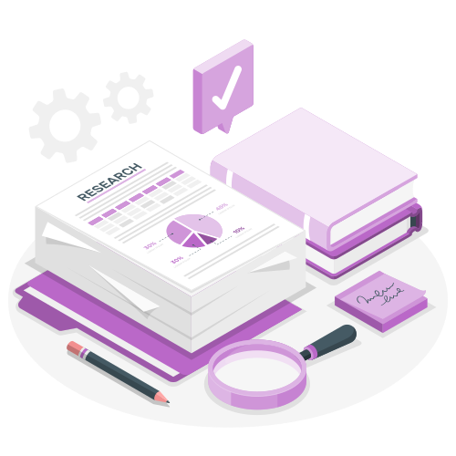

```{r,include = FALSE}
source("ref.R")
```

# <font class=mrgg>Training in research computing</font> </img>

Learn scientific programming, high-performance computing, data analysis, and visualization with SFU's Research
Computing Group. We offer webinars and courses ranging from one-hour sessions to multi-day workshops, online
or in person. Explore upcoming training, recorded webinars, and other learning resources on this site.

::: {.text-center .mt-5 layout-ncol=3}
[](getting-started)

[](fall-2026)

[](https://docs.alliancecan.ca/wiki/Technical_documentation)
:::

- To subscribe to our training calendar, go to the calendar at the bottom of this page and click "+" or "Add
  to Google Calendar".
- To receive future news and emails about the BC DRI Group and the Prairies DRI Group training events, please
  <a href="/contact" target="_blank" style="color:#0079B7;">subscribe here</a>.
- <a href="https://explora.alliancecan.ca/events" target="_blank" style="color:#0079B7;">Search Explora</a>
  for upcoming courses, webinars, and other events across Western Canada, Compute Ontario, Calcul Québec, and
  ACENET.


```{=html}
<div class="ratio ratio-16x9 mt-5 mb-4">
  <iframe src="https://calendar.google.com/calendar/embed?src=c_931e1c03612d34e93731445887914964ac4c406fd45b3c4e024af73264391906%40group.calendar.google.com&ctz=America%2FVancouver" style="border: 0" width="800" height="600" frameborder="0" scrolling="no"></iframe>
</div>
```
